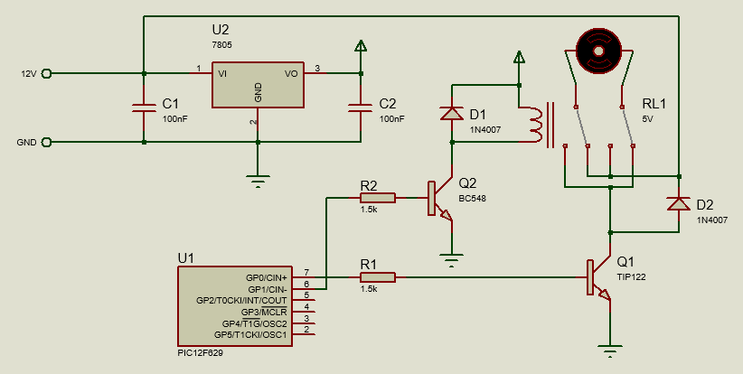
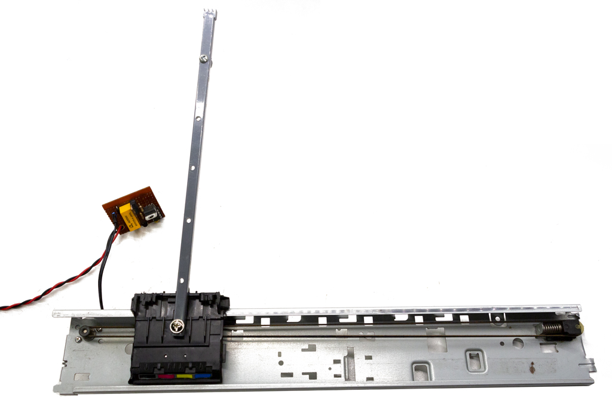

# Cat random pendulum

This repository contains the code and schematic for a simple cat toy. The toy consists of a rod that moves randomly every few seconds. Instead of a solid rod, a cable or a thread can also be used.

The electronics consist of a small PIC microcontroller (12F629) and a few components that make a hybrid h-bridge for driving a motor.

The mechanics consist of just a motor with a belt, in this case, extracted from an old printer. It's used in an open-loop fashion (no feedback, no limit switches).

The root folder contains the code and [XC8](https://www.microchip.com/en-us/development-tools-tools-and-software/mplab-xc-compilers) project.
The repository also contains a schematic made with Proteus, which also supports simulating the whole circuit.

The circuit is quite simple, it can be built in a small perfboard as shown by the photos.

[Demo video (with real cats!)](https://www.youtube.com/watch?v=83AkypU0tw0)
